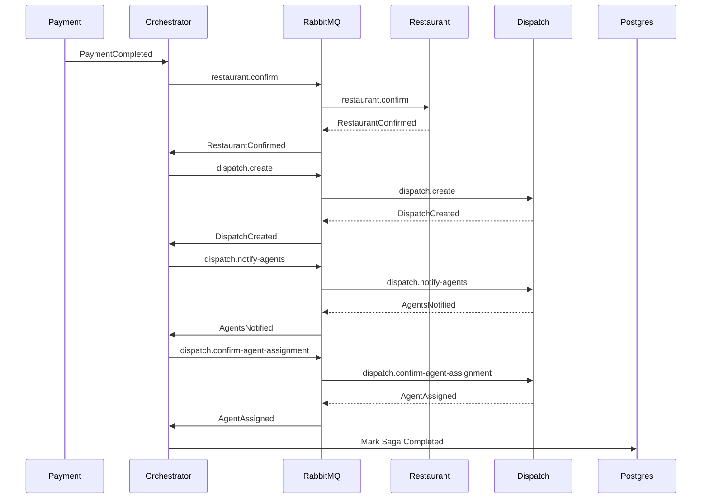
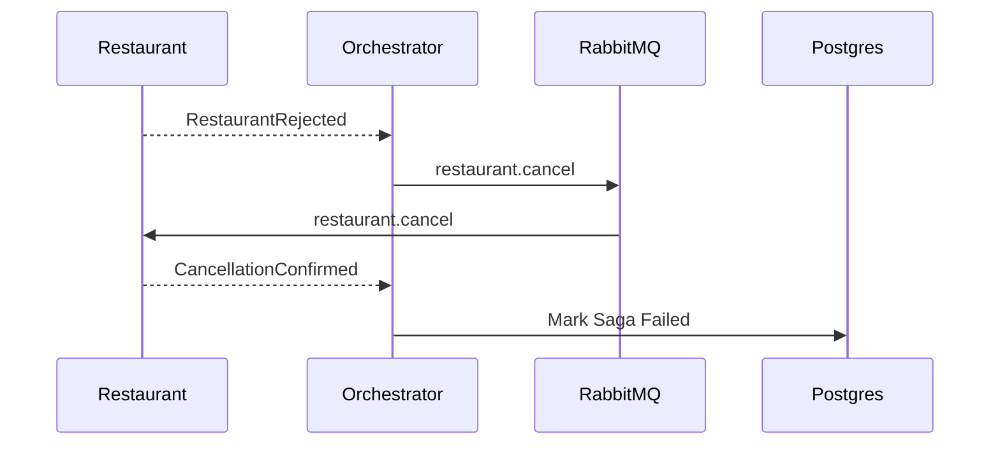
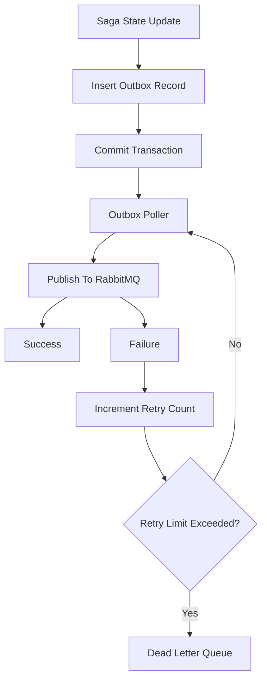

# Orchestrator Service

## Overview

SagaFlow Orchestrator is a workflow orchestration service designed to coordinate distributed business transactions across multiple microservices in a food delivery platform.

The service acts as the central coordinator for business workflows by issuing commands, consuming domain events, managing workflow state, and handling failure scenarios in a controlled and observable manner.

Rather than allowing services to communicate directly with one another, the orchestrator manages the lifecycle of a workflow using the Saga Orchestration pattern. This enables explicit control over business processes, improves observability, simplifies failure handling, and reduces coupling between services.

The current implementation focuses on the order fulfillment workflow:

Dispatch:
1. Payment is completed.
2. Restaurant accepts or rejects the order.
3. Delivery agent is assigned.
4. Workflow reaches a terminal state.

---

## Key Features

* Saga Orchestration Pattern
* Distributed Transaction Management
* Transactional Outbox Pattern
* RabbitMQ-based Event Transport
* Explicit Command and Event Contracts
* Idempotent Event Processing
* Dead Letter Queue Handling
* Publisher Backpressure Control
* Persistent Workflow State Tracking
* Retry Mechanisms
* Event-Driven Architecture

---

## Why Saga Orchestration?

The order fulfillment process spans multiple independent services and requires coordinated execution across service boundaries.

Examples include:

* Payment processing
* Restaurant acceptance
* Delivery agent assignment
* Customer notifications

These operations cannot be executed within a single database transaction because each service owns its own data and business logic.

The Saga Orchestration pattern was chosen to provide:

* Centralized workflow visibility
* Explicit state transitions
* Simplified debugging
* Deterministic failure handling
* Easier compensation workflows
* Better operational observability

Compared to Saga Choreography, orchestration provides a single source of truth for workflow progress and reduces hidden dependencies between services.

---

## Services

### Order Service

Responsible for:

* Order creation
* Order status management
* Restaurant acceptance or rejection

Produces events such as:

* OrderAccepted
* OrderRejected

Consumes commands such as:

* AcceptOrder

---

### Payment Service

Responsible for:

* Payment processing
* Payment validation
* Payment completion notifications

Produces events such as:

* PaymentCompleted
* PaymentFailed

The Payment Service currently acts as the entry point for the order fulfillment saga.

---

### Dispatch Service

Responsible for:

* Delivery agent discovery
* Agent assignment
* Agent notification

Produces events such as:

* AgentAssigned
* AgentAssignmentFailed

Consumes commands such as:

* AssignAgent

---

### Saga Orchestrator

Responsible for:

* Workflow coordination
* Saga state management
* Command dispatching
* Event consumption
* Retry handling
* Failure tracking
* Dead-letter processing

The orchestrator contains no business ownership of orders, payments, or dispatch operations. Its responsibility is workflow coordination.

---

## Architecture

## Dispatch

### Design Considerations

The current implementation intentionally separates:

- Workflow state transitions
- Command routing
- Compensation routing

This enables the orchestrator to act as a generic workflow engine rather than being tightly coupled to food delivery business logic.

Future workflows such as:

- Subscription renewals
- Refund processing
- Loyalty rewards
- Inventory reservation

can reuse the same orchestration infrastructure while providing different state definitions.

## Dispatch Workflow State Machine

```text
PAYMENT_COMPLETED
         │
         ▼
AWAITING_RESTAURANT_CONFIRMATION
         │
         ├─────────────► RESTAURANT_REJECTED
         │                       │
         │                       ▼
         │               restaurant.cancel
         │
         ▼
CREATE_DISPATCH
         │
         ▼
NOTIFY_AGENTS
         │
         ▼
CONFIRM_AGENT_ASSIGNMENT
         │
         ▼
COMPLETED
```

## State-Driven Workflow Execution

Rather than hard-coding workflow transitions throughout the codebase, the orchestrator uses a state definition model.

Example:

```typescript
{
  name: 'CREATE_DISPATCH',
  commandRoutingKey: 'dispatch.create',
  compensationRoutingKey: 'restaurant.cancel'
}
```

Benefits:

- New workflows can be added with minimal orchestration code changes
- Workflow transitions remain explicit and auditable
- Compensation actions are defined alongside forward actions
- Business process logic remains centralized
- Workflow definitions can eventually be externalized into configuration or workflow specifications


## Successful Dispatch Workflow



---

## Compensation Workflow



---

## Transactional Outbox Pattern

The orchestrator uses the Transactional Outbox Pattern to guarantee reliable event publication.

When a workflow transition occurs:

1. Saga state is persisted.
2. Outbox record is inserted.
3. Database transaction commits.
4. Poller publishes the event asynchronously.

This eliminates the possibility of updating workflow state successfully while failing to publish the corresponding event.



---

## RabbitMQ Integration

RabbitMQ acts as the transport layer for commands and events exchanged between services.

The orchestrator publishes commands and consumes resulting domain events.

Current implementation includes:

* Topic exchanges
* Multiple routing keys
* Dead letter queues
* Retry handling
* Publisher backpressure controls
* Decoupled service communication

### Publisher Backpressure

The outbox poller uses concurrency-limited publishing through `p-limit`.

This prevents:

* Excessive socket buffering
* Memory pressure
* Broker overload
* Uncontrolled producer spikes

By controlling publication concurrency, the orchestrator maintains predictable broker communication behaviour during periods of increased load.

---


---

## Reliability Features

### Idempotent Processing

Consumers safely handle duplicate event deliveries.

### Retry Mechanisms

Transient failures are retried automatically.

### Dead Letter Queue

Poison messages are isolated for investigation and recovery.

### Persistent Workflow State

Workflow progress survives service restarts and failures.

### Event Failure Tracking

Failed publications are tracked through retry counters before being routed to a dead letter queue.

---

## Future Improvements

### Distributed Tracing

Introduce OpenTelemetry-based tracing to provide end-to-end workflow visibility across services.

### RabbitMQ Access Control Lists

Apply fine-grained broker permissions to restrict service access to authorized exchanges, queues, and routing keys.

### Subscription Saga

Support long-running workflows such as subscription renewals and recurring payments.

### Containerized Deployment

Deploy using:

* Docker
* Amazon ECR
* Amazon ECS Fargate

### Workflow Versioning

Allow active workflow instances to continue executing previous workflow definitions while new versions are deployed.

### Workflow Monitoring Dashboard

Provide operational visibility into:

* Active sagas
* Failed workflows
* Retry counts
* Dead-letter events
* Workflow execution metrics
